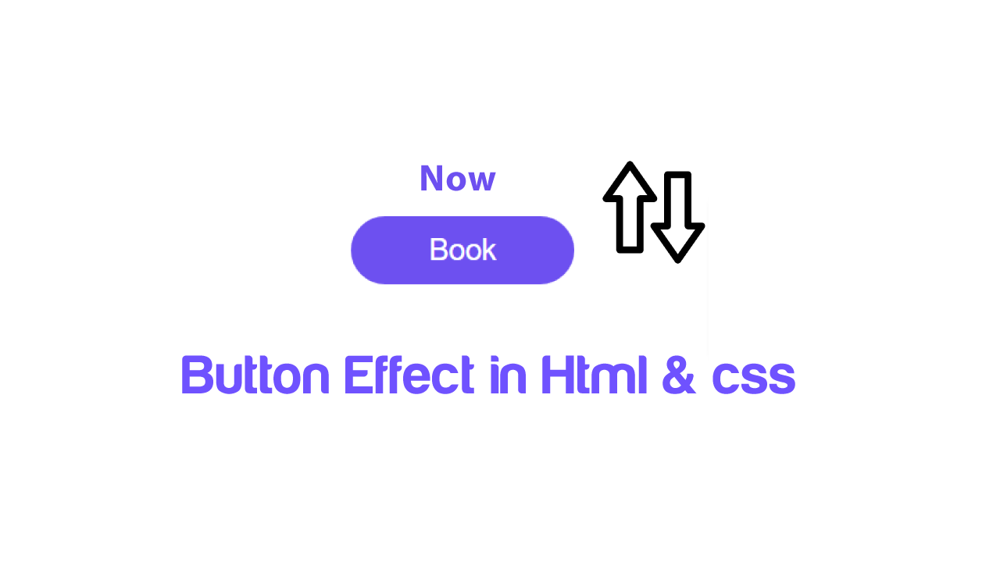

# Button Effect 01 |Css Project



[watch ▶▶](https://link)

# Source code

## HTML5
```html
<!DOCTYPE html>
<html lang="en">
<head>
    <meta charset="UTF-8">
    <meta http-equiv="X-UA-Compatible" content="IE=edge">
    <meta name="viewport" content="width=device-width, initial-scale=1.0">
    <title>button slideing hover effect</title>
    <link rel="stylesheet" href="style.css">
</head>
<body>
    <div class="container">
        <button class="btn_primary">
            <span class="visible">Book</span>
            <span class="in_visible">Now</span>
        </button>
    </div>
</body>
</html>
```

## CSS3
```css
*,
*::before,
*::after {
  margin: 0;
  padding: 0;
  box-sizing: border-box;
}
:root {
  --btn-bg: rgb(109, 80, 240);
  --btn-hover-bg: rgb(70, 40, 207);
  --btn-shadow: rgba(85, 54, 223, 0.8);
}
html {
  font-size: 62.5%;
}
.container {
  max-width: 114rem;
  margin: 0 auto;
}
.btn_primary {
  margin-top: 4rem;
  font-size: 1.7rem;
  font-weight: 400;
  display: inline-block;
  text-transform: capitalize;
  border-radius: 10rem;
  border: none;
  background: var(--btn-bg);
  color: white;
  position: relative;
  overflow: hidden;
  cursor: pointer;
}
.btn_primary > * {
  display: inline-block;
  height: 100%;
  width: 100%;
  transition: all 0.2s;
}
.visible {
  padding: 1rem 4.5rem;
}
.in_visible {
  position: absolute;
  padding: 1rem 0;
  left: 0;
  top: -100%;
}
.btn_primary:hover {
  background: var(--btn-hover-bg);
}
.btn_primary:hover .visible {
  transform: translateY(100%);
}
.btn_primary:hover .in_visible {
  top: 0;
}
.btn_primary:focus {
  outline: none;
  box-shadow: 0 0 1rem var(--btn-shadow);
}
```